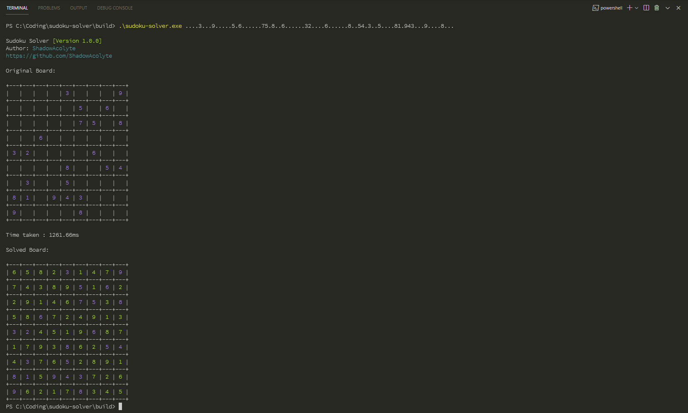
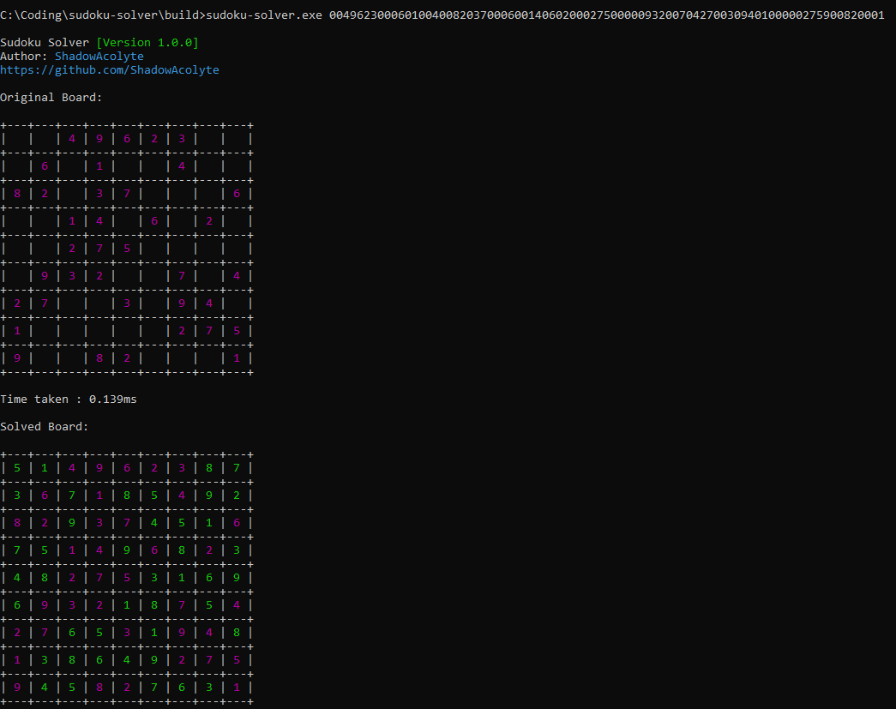
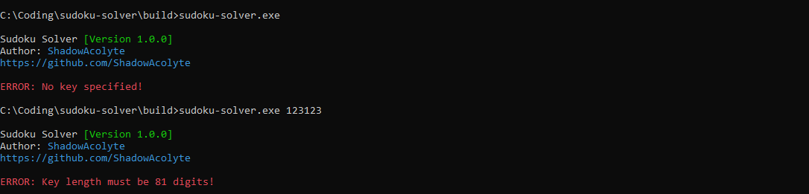

# sudoku-solver
 Command line sudoku solver written in C++

## Input
 The solver takes input in the following formats:
 ```004962300060100400820370006001406020002750000093200704270030940100000275900820001```
 ```....3...9.....5.6......75.8..6......32....6......8..54.3..5....81.943...9....8...```

 Make sure that the string length is exactly 81 characters, and include trailing '0's and '.'s

## Building from source
 Go into a directory of your choice, and clone the repository:

 ```git clone https://github.com/ShadowAcolyte/sudoku-solver.git```

 A `CMakeLists.txt` file is present in the root directory. Install [CMake](https://cmake.org/download/) and build the CMake file.

## Screenshots
 
 
 